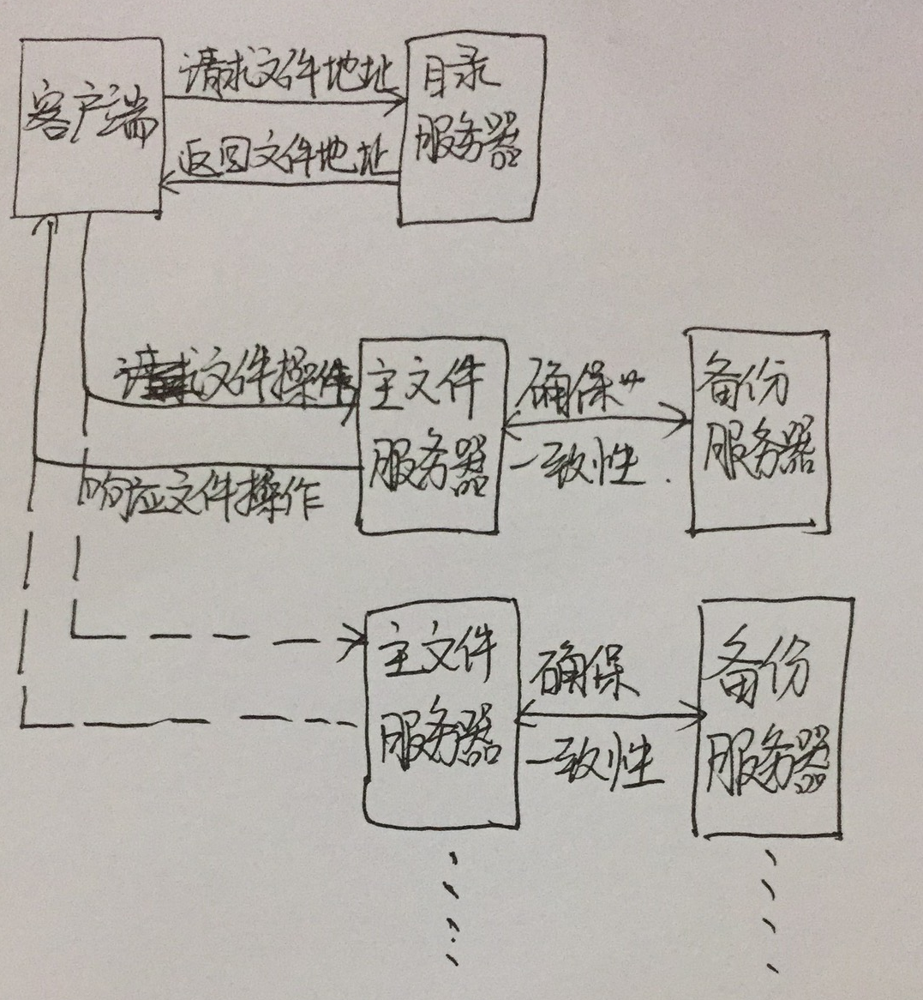

# 分布式文件系统

## 项目规划

### 项目框架

采用客户端-服务器模型，设置目录服务器和文件服务器。目录服务器记录文件的所在服务器，文件服务器存储独立文件，向客户端提供整个文件。客户端请求文件时首先访问目录服务器，获取文件当前的位置，再根据取得的位置访问文件服务器请求对应的文件。每个文件服务器配备一个备份服务器，备份服务器存储它对应的主文件服务器上的文件，使文件有多个副本，且仅与它对应的主文件服务器交互，以确保数据的可用性。主文件服务器与客户端交互，提供基础的文件操作。

客户端的文件操作：

1. 下载文件：先访问目录服务器获取文件所在的文件服务器，再去对应的文件服务器上下载文件到本地。

2. 上传文件：先访问目录服务器获取要上传的文件所在的文件服务器，若文件不存在则用调度算法选择一个文件服务器作为存储该文件的对象然后返回地址给客户端，若文件存在则直接返回文件所在地给客户端，然后客户端再将文件上传到对应的服务器

3. 删除文件：先检查本地目录是否有该文件，有则删除。再访问目录服务器获取要删除的文件所在的文件服务器，若文件不存在则返回文件不存在的消息，若文件存在则在文件服务器上删除文件然后返回删除结果给客户端。

用户读文件，实际上需要先下载文件，然后自己再在本地打开文件。
用户新建文件，实际上先自己的本地新建然后再上传到文件服务器。
用户写文件，实际上需要先下载文件，然后自己在本地打开文件修改，修改完成再上传。

因此服务器只需要提供文件下载、文件上传和文件删除的功能即可。

服务端的文件操作：

1. 下载文件：以二进制方式打开文件获取文件内容然后传输给客户端，若主文件服务器找不到文件，则去对应的备份服务器找。若找到则将备份服务器的文件传给主文件服务器，然后主文件服务器再传给客户端。若找不到则然后错误信息。

2. 上传文件：接收客户端传来的数据，包括文件名、文件内容，然后创建或修改文件服务器以及备份服务器对应文件的内容

3. 删除文件：删除主文件服务器和备份服务器上的文件

上面的功能看起来像是一个FTP服务器。因为没有考虑多用户读写的情况。
要确定用户写操作互斥，以及并行读且保证读取的内容一致，需要对文件加锁。
文件加锁操作由文件服务器执行，分为读锁和写锁。

读锁：支持多用户并行读，所以当用户请求读文件时，若文件已加了读锁，仍可以再读。
写锁：用于写互斥
